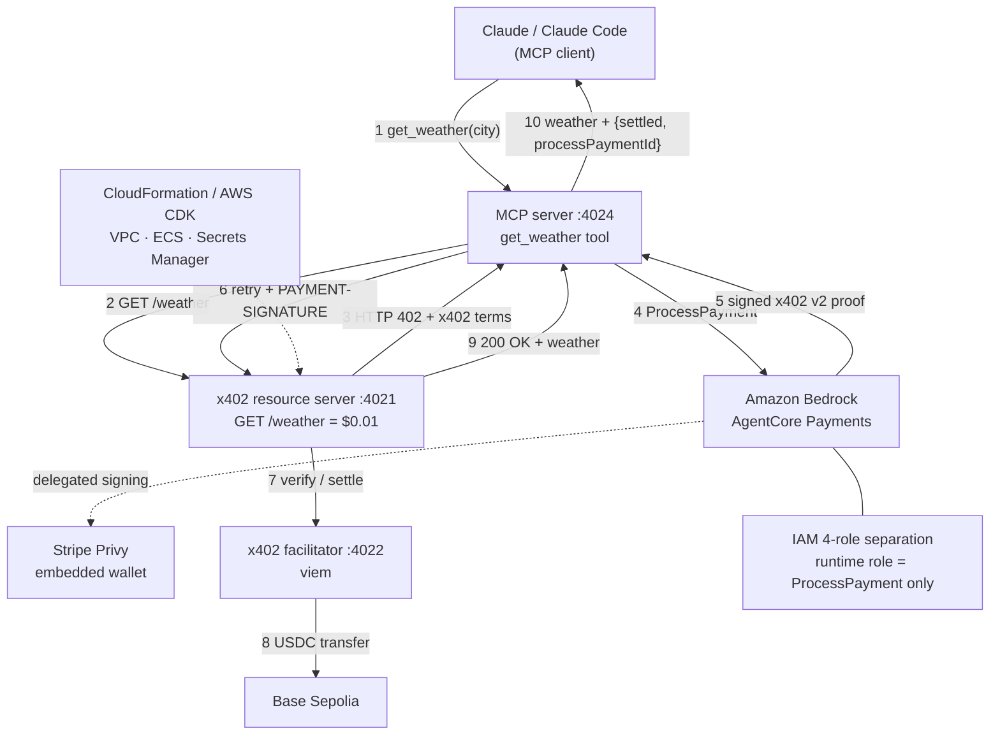

# agentcore-payments-sample2

**English** ・ [日本語](./README_ja.md)

An end-to-end proof that an AI agent can pay for a paywalled API on its own,
safely, using **Amazon Bedrock AgentCore Payments** and the **x402** payment
protocol.

- A weather API protected by x402 (`GET /weather`, $0.01, Base Sepolia).
- Payment execution is delegated to **Amazon Bedrock AgentCore Payments** (the
  `ProcessPayment` API); the wallet provider is **Privy** (`StripePrivy`
  connector).
- The whole flow is callable from **Claude Code** over **MCP**.

Spend limits are enforced by AWS — a budgeted, expiring **Payment Session** and a
runtime IAM role that can *only* call `ProcessPayment` — not by prompt
engineering. The model never sees a private key or the signed payment proof.



For the full design (architecture, sequence diagrams, AWS services, IAM model)
see [`docs/design.md`](docs/design.md); the challenge write-up is in
[`docs/builder-showcase-article.md`](docs/builder-showcase-article.md).

## Monorepo layout

```
apps/
  x402/
    server/       # Seller: the x402-protected weather API (Hono)
    facilitator/  # Seller: runs x402 /verify and /settle on-chain (Base Sepolia)
    client/       # Payer: verification script (Goal 1)
  mcp/            # Payer: MCP server called from Claude Code; pays on the agent's behalf (Goal 2)
  mpp/            # MPP (Machine Payment Protocol) reference impl. Not touched in this phase
  cdk/            # AWS infra (ECS Fargate + ALB + own ECR + AgentCore Payments IAM)
packages/
  shared/         # zod validation + AgentCore Payments helpers (processX402Payment, ...)
```

## Prerequisites

- Node.js 22+, `pnpm@10.33.0` (`corepack enable` recommended)
- An AWS account and a configured CLI profile (`aws configure`) in a region where
  Amazon Bedrock AgentCore Payments is available
- A [Privy dashboard](https://dashboard.privy.io/) account (wallet provider)
- Base Sepolia testnet funds (USDC + ETH) — e.g. from the
  [Circle Faucet](https://faucet.circle.com/)
- Docker, if you deploy to AWS (`cdk deploy` builds Docker images)

```bash
git clone https://github.com/mashharuki/agentcore-payments-sample2.git
cd agentcore-payments-sample2
pnpm install
```

## Quickstart (local)

Run the two seller services in separate terminals.

```bash
# 1. facilitator (verifies payments and settles them on-chain)
cp apps/x402/facilitator/.env.example apps/x402/facilitator/.env
# set EVM_PRIVATE_KEY in .env (gas-paying EOA, needs Base Sepolia ETH)
pnpm facilitator dev

# 2. resource server (the x402-protected /weather API)
cp apps/x402/server/.env.example apps/x402/server/.env
# set FACILITATOR_URL=http://localhost:4022 and EVM_ADDRESS (payTo wallet) in .env
pnpm x402server dev
```

At this point `curl http://localhost:4021/weather` returns `402 Payment Required`
(the payment terms are base64-encoded in the `payment-required` header). To
actually complete a payment, set up AgentCore Payments below.

## Amazon Bedrock AgentCore Payments setup

The payer does not sign with a local private key. It calls the AWS-managed
**AgentCore Payments** `ProcessPayment` API to obtain a payment proof; the
underlying signing is done by Privy (the `StripePrivy` connector).

Run the steps below in order. Everything goes through
`apps/cdk/scripts/agentcore-payments-admin.ts`
(`pnpm --filter cdk payments:admin <subcommand>`), executed **by a human on a
TTY** — the four-role IAM separation model (design.md §7.2) makes interactive
approval and credential entry mandatory.

> **Use `us-west-2` for everything.** AgentCore Payments is only available in
> `us-east-1 / us-west-2 / eu-central-1 / ap-southeast-2` (not `ap-northeast-1`).

### 1. Create a Privy app

1. In the [Privy dashboard](https://dashboard.privy.io/), create a **dedicated**
   app for this project (do not reuse an app that serves other purposes).
2. Note the `App ID` and `App Secret`.
3. Under **Wallet Infrastructure > Keys and quorums**, generate a new P-256 key
   pair and note the `Authorization ID` and `Authorization Private Key`.

### 2. Deploy FoundationStack (the IAM roles)

```bash
AWS_REGION=us-west-2 CDK_DEFAULT_REGION=us-west-2 pnpm cdk run deploy 'FoundationStack'
```

Note the `ResourceRetrievalRoleArn` output (used in the next step).

### 3. Create the PaymentManager / PaymentConnector

```bash
cd apps/cdk
RESOURCE_RETRIEVAL_ROLE_ARN=<ARN from step 2> pnpm payments:admin setup-connector
```

You will be prompted for the Privy credentials (App ID / App Secret /
Authorization ID / Authorization Private Key). Input is not echoed and is never
stored outside the process. On success it prints `PAYMENT_MANAGER_ARN` and
`PAYMENT_CONNECTOR_ID` — note them.

### 4. Create the Payment Instrument (wallet), fund it, and grant signing

```bash
PAYMENT_MANAGER_ARN=<step 3 ARN> PAYMENT_CONNECTOR_ID=<step 3 ID> pnpm payments:admin create-instrument
```

Enter a user ID (e.g. your email) and a wallet-linking email; it prints
`PAYMENT_INSTRUMENT_ID`.

**Because this project uses the Stripe (Privy) connector, there is no hosted
"just open it" `redirectUrl` like Coinbase's** (`create-instrument` prints
`(redirectUrl was not returned…)` — that is expected). Funding and signing
delegation are done by running the Privy reference frontend (Next.js) locally
([AWS docs](https://docs.aws.amazon.com/bedrock-agentcore/latest/devguide/payments-fund-wallet.html)).

```bash
git clone https://github.com/privy-io/aws-agentcore-sdk.git
cd aws-agentcore-sdk
```

Create `.env.local` (same values you entered in step 3):

```bash
NEXT_PUBLIC_PRIVY_APP_ID=<Privy App ID>
PRIVY_APP_SECRET=<Privy App Secret>
NEXT_PUBLIC_PRIVY_SIGNER_ID=<Privy Authorization ID (Key ID; a public identifier, safe client-side)>
NEXT_PUBLIC_NETWORK_MODE=testnet
```

1. In the Privy dashboard, allowlist `http://localhost:3000` under
   **App Settings > Basics > Domains**.
2. `pnpm install && pnpm dev`, then open `http://localhost:3000`.
3. Log in with **the same wallet-linking email you passed to `create-instrument`**
   (embedded Base / Solana wallets are created automatically on login).
4. **Fund:** paste the wallet address shown in the UI into the
   [Circle faucet](https://faucet.circle.com/), select **Base Sepolia**, receive
   testnet USDC.
5. **Grant signing (delegation):** on the home screen, "Connect agent" →
   "Give access". The Authorization ID is registered as a session signer on the
   wallet.

Until both funding and delegation are done, `PAYMENT_INSTRUMENT_ID` shows a zero
balance and `ProcessPayment` fails. After that, `pnpm payments:admin status`
shows the balance.

### 5. Create a Payment Session (budget + expiry)

```bash
PAYMENT_MANAGER_ARN=<step 3 ARN> PAYMENT_USER_ID=<user ID from step 4> pnpm payments:admin new-session
```

Enter a max budget and an expiry (15–480 minutes, an AWS constraint), then type
`approve` to confirm (non-interactive callers cannot approve). It prints
`PAYMENT_SESSION_ID`.

> Sessions expire. Re-run `new-session` for a fresh `PAYMENT_SESSION_ID` whenever
> you resume testing.

## Goal 1: verify payment with the x402 client alone

```bash
cp apps/x402/client/.env.example apps/x402/client/.env
```

Set the following in `.env` (AWS credentials come from your local `aws configure`
profile, so they are **not** in `.env`):

```bash
AWS_REGION=us-west-2
PAYMENT_MANAGER_ARN=<step 3>
PAYMENT_INSTRUMENT_ID=<step 4>
PAYMENT_SESSION_ID=<step 5>
PAYMENT_USER_ID=<same user ID as steps 4/5>
PAYWALL_API_BASE_URL=http://localhost:4021
PAYWALL_PATH=/weather
```

```bash
pnpm x402client dev
```

On success the script prints a line reporting the payment settled together with
its `processPaymentId`.

## Goal 2: verify payment from Claude Code over MCP

### 2-1. Prepare `apps/mcp/.env`

You can reuse the working `apps/x402/client/.env` (`PAYWALL_PATH` is extra but
ignored; `PORT` defaults to 4024):

```bash
cp apps/x402/client/.env apps/mcp/.env
```

Or set it manually (see `apps/mcp/.env.example`):

```bash
AWS_REGION=us-west-2
PAYMENT_MANAGER_ARN=<same as Goal 1>
PAYMENT_INSTRUMENT_ID=<same as Goal 1>
PAYMENT_SESSION_ID=<same as Goal 1 (re-issue with new-session if expired)>
PAYMENT_USER_ID=<same as Goal 1>
PAYWALL_API_BASE_URL=http://localhost:4021
PORT=4024
```

### 2-2. Start the three services (one terminal each)

```bash
pnpm x402server dev     # :4021 resource server
pnpm facilitator dev    # :4022 verify + on-chain settle
pnpm mcp dev            # :4024 MCP server (get_weather tool)
```

### 2-3. Smoke test without Claude Code

```bash
pnpm --filter mcp call            # calls get_weather once (WEATHER_CITY sets the city)
```

If it returns
`{"city":"Tokyo","weather":"sunny","temperature":70,"payment":{"settled":true,"processPaymentId":"..."}}`,
the full path works: MCP → x402 (402) → AgentCore Payments (`ProcessPayment`) →
facilitator on-chain settlement (USDC $0.01 on Base Sepolia) → weather returned.

### 2-4. Connect Claude Code

`apps/mcp/.mcp.example.json` defines this MCP server
(`x402-weather` → `http://localhost:4024/mcp`). Register it either way:

```bash
# A: use it as a repo-root .mcp.json (Claude Code auto-detects it; needs approval)
cp apps/mcp/.mcp.example.json .mcp.json

# B: add it via the CLI
claude mcp add --transport http x402-weather http://localhost:4024/mcp
```

Check `claude mcp list` for `x402-weather` (if it shows `⏸ Pending approval`,
approve it in Claude Code and the health check will pass).

Once approved, calling `get_weather` (`mcp__x402-weather__get_weather`) from
Claude Code runs the AgentCore Payments flow internally and returns the weather
plus payment metadata (`processPaymentId`). The signed proof and the raw
`PAYMENT-SIGNATURE` header are never exposed to the model.

> To use it from the standalone **Claude Desktop app** (not Claude Code),
> configure the `mcp-remote` bridge in `claude_desktop_config.json`:
> ```json
> { "mcpServers": { "x402-weather": {
>   "command": "npx",
>   "args": ["-y", "mcp-remote", "http://localhost:4024/mcp", "--allow-http"]
> } } }
> ```

## Deploy to AWS (production-like hosting)

```bash
# 1. Seller side (resource server + facilitator)
pnpm cdk deploy FoundationStack X402WeatherStack

# 2. Put the facilitator's gas-paying key into Secrets Manager
#    (value via console/CLI only; never in git)
aws secretsmanager put-secret-value \
  --secret-id agentcore-payments-sample/dev/facilitator-evm-private-key \
  --secret-string '{"EVM_PRIVATE_KEY":"0x..."}'

# 3. Run the "Amazon Bedrock AgentCore Payments setup" above

# 4. Payer side (MCP server). PAYMENT_MANAGER_ARN etc. come from step 3
SELLER_PAYTO_ADDRESS=<payTo wallet> \
PAYMENT_MANAGER_ARN=<...> PAYMENT_INSTRUMENT_ID=<...> \
PAYMENT_SESSION_ID=<...> PAYMENT_USER_ID=<...> \
pnpm cdk deploy McpStack
```

After deploy, pass the `McpStack` output `McpServerUrl` to
`claude mcp add --transport http x402-weather <URL>` to connect to the MCP server
on AWS. **Note the ALB uses its default DNS name (no custom domain), so the
connection is plain HTTP** (design.md §7.6).

For details (stack layout, IAM design, destroy steps) see
[`apps/cdk/README.md`](apps/cdk/README.md).

## Troubleshooting

| Symptom | Cause / fix |
|---|---|
| The first request right after starting the resource server returns 500 | Race with facilitator startup. Retry once the facilitator is up. |
| `CreatePaymentManager` fails with `Role validation failed` | FoundationStack region and the admin script region differ. Put both on `us-west-2`. |
| `CreatePaymentManager` fails with `missing the required permission: bedrock-agentcore:CreateWorkloadIdentity` | The BYO role has no base permissions. Redeploy the latest `FoundationStack` (they are attached to `ResourceRetrievalRole`). |
| `ProcessPayment` / payment returns `Your session has expired` | Payment Session expired. Re-run `pnpm payments:admin new-session` and update `PAYMENT_SESSION_ID` in `.env`. |
| The post-payment request returns an empty `402 {}` | x402 v2 reads the `PAYMENT-SIGNATURE` header. Use the latest `packages/shared`. |
| Wallet balance stays at 0 | Funding / delegation not completed in the Privy frontend (step 4). |
| `cdk deploy` fails with a Docker error | Check Docker is running (`docker info`). |

## Dev commands

```bash
pnpm format   # biome format --write .
pnpm check    # biome check --write . (format + lint)
pnpm knip     # find unused files / exports / deps
pnpm jscpd    # copy-paste detection
```

## License

[MIT](./LICENSE)

## On-chain record of an x402 stablecoin payment

[BaseScan - 0x64d08bb4071635890366ade57daba52c75a9a6fe3e5202a87b706df42edb78e0](https://sepolia.basescan.org/tx/0x64d08bb4071635890366ade57daba52c75a9a6fe3e5202a87b706df42edb78e0)
