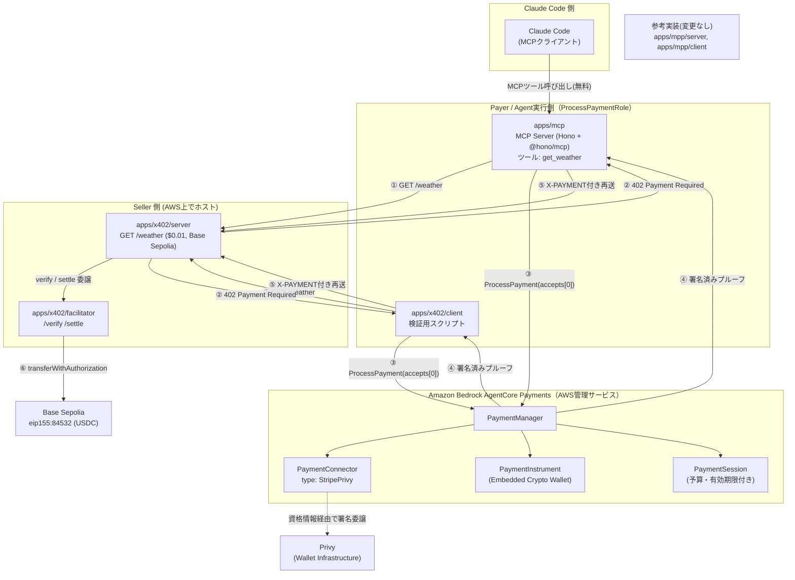
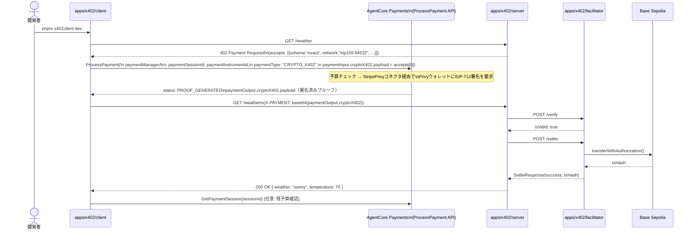
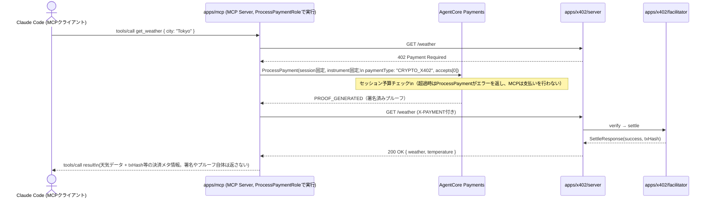
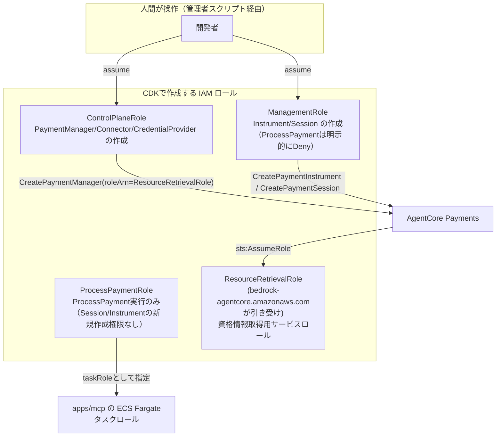
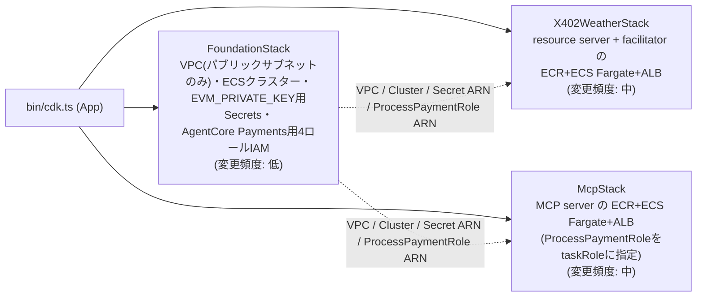
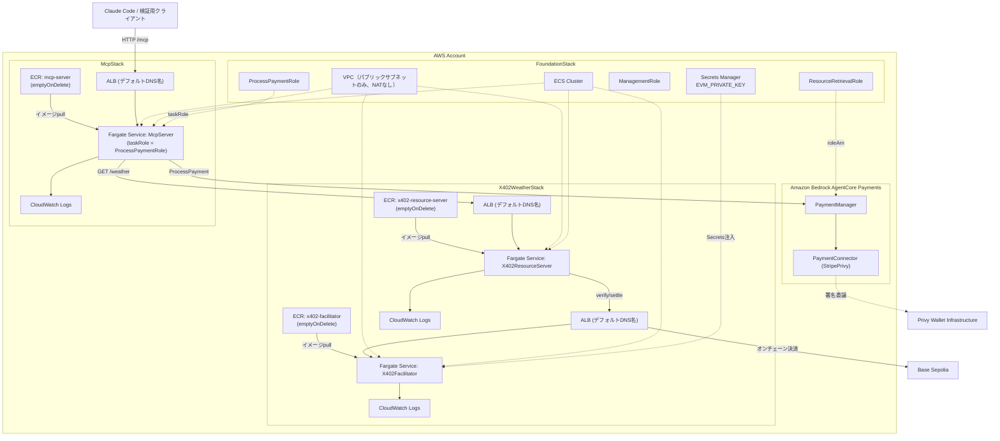
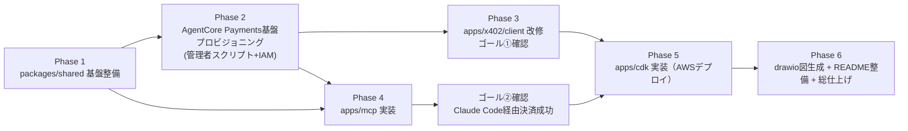

# 設計書

## 0. 本書の位置づけ・改訂履歴

`docs/requirement.md` の要件を満たすための実装計画。現時点のリポジトリ実装状況を棚卸しした上で、
「今あるもの」「これから作るもの」を明確にし、アーキテクチャ・データフロー・AWSインフラ・実装順序を定義する。

| 版 | 日付 | 変更内容 |
|---|---|---|
| v1 | 2026-08-21 | 初版。x402プロトコルを自前実装（自前facilitator + 直接viem/Privy署名）する構成で設計 |
| v2 | 2026-08-21 | ユーザーレビューにより方針転換。実際の Amazon Bedrock AgentCore Payments 管理サービス（`PaymentManager` / `PaymentConnector` / `ProcessPayment` 等のAWS API）へ全面移行する設計に更新 |
| v3 | 2026-08-21 | ユーザー確認により、対応ネットワークを Base Sepolia のみに確定。Worldchain Sepolia対応は撤去する（v2では「将来の直接署名フロー用に残置」としていたコードも削除する） |
| **v4** | **2026-08-21** | **ホスティング方式を AWS App Runner から Amazon ECS Fargate（+ ALB）に変更（App Runnerの提供終了が見込まれるため）。ECRリポジトリをCDKで自前管理し、イメージのビルド＆プッシュ・削除をスタックのデプロイ/デストロイに同期させる。カスタムドメインは使わずALBのデフォルトDNS名を使用する。** |

**v2での主な変更点（要件定義書との差分として明示）：**

1. Payer（支払う側）の署名・決済実行を、ローカルの秘密鍵/Privy直接署名から **Amazon Bedrock AgentCore Payments の `ProcessPayment` API** 呼び出しに置き換える。Wallet Provider要件の「Privy」は、AgentCore Payments の **StripePrivy コネクタ**として実現する（Privyを直接のviem署名者として使う設計ではなくなる）。
2. AgentCore Payments が公式にサポートするネットワークは **Base Sepolia (`eip155:84532`) と Solana Devnet** のみで、**Worldchain Sepolia (`eip155:4801`) は非対応**（2026-08-21時点、AWS公式ドキュメント確認済み）。そのため `apps/x402/server` が広告する `accepts[]` から Worldchain Sepolia を外し、**Base Sepolia に一本化**する。要件定義書の「標準では対応していないWorld Sepoliaに対応させた自前ファシリテーター」という記述と矛盾するが、**v3にてユーザーが対応ネットワークをBase Sepoliaのみとすることを確定**した。これに伴い `apps/x402/facilitator` のWorldchain Sepolia対応コード（`worldchainSepolia`/`chainInfo`まわりの登録一式）も**撤去する**（v2時点では「将来の直接署名フロー用に残置」としていたが、方針確定によりシンプルさを優先し削除する）。
3. Seller（決済を受け取る側）の `apps/x402/server` + `apps/x402/facilitator` の役割は変わらない。AgentCore Payments はあくまで **Payer側の署名・支払いプルーフ生成を代行する**サービスであり、402応答の検証（`/verify`）とオンチェーン決済実行（`/settle`）はAWS公式ドキュメント上も引き続き「マーチャント（＝Seller）側の責務」と明記されている。したがって自前facilitatorは維持する。
4. IAM設計に **4ロール分離モデル**（ControlPlaneRole / ManagementRole / ProcessPaymentRole / ResourceRetrievalRole）を追加する（AWS公式のセキュリティベストプラクティス）。

本書は実装前の設計合意用ドキュメントであり、実装が進むにつれて追記・更新する。7章のAWS構成図は
CDKコード実装後に `cdk-aws-diagram` skill で生成する drawio 図と整合させる。

---

## 1. 目的とゴール

Amazon Bedrock AgentCore Payments が GA されたことを受け、その中核である **x402 決済プロトコル**、および
**AgentCore Payments 管理サービスそのもの**を自前のモノレポで一気通貫に実装し尽くすことで仕組みを完全に理解する。
将来的に MPP（Machine Payment Protocol）にも対応するが、MPP のサーバー・クライアントは既に検証済みのサンプル
コードとして先行実装済みのため、本設計では **x402 を最優先**で完成させる。

達成すべきゴールは要件定義書のとおり2点：

1. **x402 用クライアント（`apps/x402/client`）単体で x402 決済が完了すること**
   → v2では「AgentCore Paymentsの`ProcessPayment`で決済プルーフを生成し、自前resource server/facilitatorで
   検証・オンチェーン決済する」フローで達成する。
2. **Claude Code から MCP（`apps/mcp`）経由で x402 決済が完了すること**
   → v2では、MCPサーバー自身が「エージェント実行ロール（ProcessPaymentRole）」を持つ決済主体となり、
   `ProcessPayment` を呼び出して決済を代行する。

加えて、以下を満たす：

- Wallet Provider として **Privy** を採用する → **AgentCore Payments の StripePrivy コネクタ**として統合する
- `/weather` エンドポイントを $0.01 で x402 課金する（実装済み。ネットワークはBase Sepoliaに一本化）
- CDK スタックはベストプラクティスに従い、論理ID・各サービスのオプションを外出しして切替可能にする
- CDK スタックは `cdk destroy` で ロググループを含む全リソースを削除できる（AgentCore Payments側リソースは
  CDK管理外である点を明記する。7.5節参照）
- CDK スタックは再デプロイしてもエラーが発生しない設計にする
- README はユーザーがつまずかないよう丁寧かつ網羅的に整備する
- drawio による美しいシステムアーキテクチャ図を作成する
- 設計書には mermaid でシーケンス図等を記載する（本書）
- 採用した AWS サービス一覧をまとめる（7.1章）
- 実装時は Skill / MCP / サブエージェントを積極活用する（11章）

---

## 2. 現状分析（リポジトリ棚卸し）

`git log` / 実コード確認ベース（推測なし）。2026-08-21 時点。v1から変更なし。

| パス | 状態 | 内容 |
|---|---|---|
| `apps/x402/server` | ✅ 実装済み・動作確認済み | Hono製リソースサーバー。`GET /weather` を `$0.01`（Base Sepolia）または USDC（Worldchain Sepolia）で課金。決済の検証・実行は `FACILITATOR_URL` の facilitator に委譲。**v2でBase Sepoliaのみに変更**（1章） |
| `apps/x402/facilitator` | ✅ 実装済み・動作確認済み | Hono + viem 製の自前ファシリテーター。現状 `worldchainSepolia` と `baseSepolia` の2チェーン分の `ExactEvmScheme` / `UptoEvmScheme` を登録。`POST /verify` `POST /settle` `GET /supported` `GET /health`。**役割（verify/settle実行基盤）は維持するが、v3でBase Sepolia単一チェーンに縮小** |
| `apps/x402/client` | ✅ 実装済み・動作確認済み | 検証用スクリプト。現状は `viem.privateKeyToAccount` で直接署名。**v2で `ProcessPayment` 呼び出しに置き換え** |
| `apps/mcp` | ⚠️ **スケルトンのみ** | `McpServer` インスタンスを生成しているだけで、transport接続もツール登録も無し。**未実装** |
| `apps/mpp/server` `apps/mpp/client` | ✅ 実装済み・動作確認済み（先行サンプル） | 変更なし |
| `apps/cdk` | ❌ **空のスキャフォールドのみ** | `CdkStack` にリソース定義なし。**未実装** |
| `packages/*` | ❌ 未使用（空ディレクトリ） | zodバリデーション等の共通ユーティリティが未着手 |
| README | ⚠️ 最小限 | 各アプリのREADMEも内容が薄い |
| drawio アーキテクチャ図 | ❌ 未着手 | `docs/` にファイルなし |

---

## 3. 全体アーキテクチャ

### 3.1 論理アーキテクチャ図



### 3.2 コンポーネント一覧

| コンポーネント | 役割 | 実装状況 | ホスティング先 |
|---|---|---|---|
| `apps/x402/server` | Seller。x402 で保護された `/weather` API（Base Sepoliaのみ） | 既存＋config縮小 | AWS（7章） |
| `apps/x402/facilitator` | `/verify` `/settle` を実行する決済実行基盤（Base Sepolia単一） | 既存＋Worldchain Sepolia撤去 | AWS（7章） |
| `apps/x402/client` | 検証用の Payer スクリプト。`ProcessPayment` 呼び出しに置換。ゴール①の主体 | 既存＋大幅改修 | ローカル実行（開発者のAWS認証情報を使用） |
| `apps/mcp` | MCP Server。内部で `ProcessPayment` を呼び出し決済を代行。ゴール②の主体 | **新規実装** | ローカル→AWS（ECS Fargate、taskRole=ProcessPaymentRoleで実行） |
| Amazon Bedrock AgentCore Payments | PaymentManager/Connector/Instrument/Sessionを管理するAWS管理サービス | **新規プロビジョニング**（CDK外、管理者スクリプト） | AWS（リージョン制約あり） |
| `apps/mpp/server` `apps/mpp/client` | MPP のリファレンス実装（変更しない） | 既存 | ローカル |
| `packages/shared` | zod によるスキーマ検証・共通ユーティリティ | **新規実装** | — |
| `apps/cdk` | Seller側サービス＋AgentCore Payments用IAMロール一式 | **新規実装** | — |

---

## 4. ペイメントフロー設計（シーケンス図）

### 4.1 ゴール①：x402クライアント単体での決済（`apps/x402/client`）



### 4.2 ゴール②：Claude Code → MCP → x402決済

Claude Code（MCPクライアント）は x402 の秘密鍵やウォレット、AWS認証情報を一切知らない。
**MCPサーバー自身が「エージェント実行ロール（ProcessPaymentRole）」で動作し、無料のMCPツール呼び出しの
裏で `ProcessPayment` を呼び出して決済を代行する**。これはAWS公式の4ロール分離モデル（7.2節）における
「決定的なコードパスがエージェントに代わって支払いを実行する」という設計そのものであり、
`aws-agents:agents-pay` skill が示す「支払い判断はモデルではなくコードで完結させる」方針とも一致する。



**接続方法**（変更なし）：`apps/mcp` は `@hono/mcp` の Streamable HTTP Transport で `POST /mcp` を公開する。

```bash
claude mcp add --transport http weather-x402 http://localhost:4024/mcp
```

### 4.3 （参考）MPPフロー概要

変更なし。MPPは本フェーズの対象外。

---

## 5. Wallet Provider: AgentCore Payments 経由での Privy 統合設計

### 5.1 アーキテクチャの転換（v1→v2）

v1では Privy を「viemの `Account` を直接ラップする署名者」として `@x402/evm` の `ExactEvmScheme(signer)` に
渡す設計だった。v2では、**Privyそのものを直接コードから呼ばない**。代わりに：

- Privyは Amazon Bedrock AgentCore Payments の **`PaymentConnector`（`paymentConnectorType: "StripePrivy"`）**
  としてAWS側に登録する。
- ウォレットの資格情報（Privy App ID / App Secret / Authorization ID / Authorization Private Key）は
  **AgentCore Identity 経由で AWS Secrets Manager に保管**され、アプリケーションコードからは一切参照しない。
- アプリケーションコード（`apps/x402/client`、`apps/mcp`）は AWS SDK for JavaScript の
  `@aws-sdk/client-bedrock-agentcore`（データプレーン）のみを扱い、`ProcessPayment` / `GetPaymentSession` /
  `GetPaymentInstrumentBalance` を呼び出す。**Privyの秘密鍵・APIキーはアプリケーションの実行時コンテキストに
  一切現れない**（IAMロールによるAWSサービス間委譲のみ）。

> 出典（2026-08-21確認）：[How AgentCore payments works](https://docs.aws.amazon.com/bedrock-agentcore/latest/devguide/payments-how-it-works.html)、
> [Process a payment](https://docs.aws.amazon.com/bedrock-agentcore/latest/devguide/payments-process-payment.html)、
> [AgentCore payments quick start](https://docs.aws.amazon.com/bedrock-agentcore/latest/devguide/payments-getting-started.html)、
> [IAM roles for AgentCore payments](https://docs.aws.amazon.com/bedrock-agentcore/latest/devguide/payments-iam-roles.html)

### 5.2 プロビジョニングするAWSリソース（一度きりのセットアップ、人間が実行）

| リソース | 作成API | 内容 |
|---|---|---|
| PaymentCredentialProvider | `CreatePaymentCredentialProvider`（`credentialProviderVendor: "StripePrivy"`） | Privyの `App ID` / `App Secret` / `Authorization ID` / `Authorization Private Key` をSecrets Manager経由で保管 |
| PaymentManager | `CreatePaymentManager` | アカウント単位の決済オーケストレーションのトップレベルリソース。`roleArn` に ResourceRetrievalRole（7.2節）を指定 |
| PaymentConnector | `CreatePaymentConnector`（`paymentConnectorType: "StripePrivy"`） | PaymentManagerとPrivy資格情報プロバイダを紐付け |
| PaymentInstrument | `CreatePaymentInstrument`（`paymentInstrumentType: "EMBEDDED_CRYPTO_WALLET"`, `network: "ETHEREUM"`） | 開発者自身のメールアドレスに紐づく組み込みウォレット。作成直後は残高0。`redirectUrl` を開いて **開発者自身が** テストネットUSDCを入金し、エージェントへの署名権限を許可する必要がある |
| PaymentSession | `CreatePaymentSession`（`limits.maxSpendAmount`, `expiryTimeInMinutes`） | 予算・有効期限付きの決済コンテキスト |

これらは **CDKではなく、管理者権限（ControlPlaneRole / ManagementRole）を持つ人間が実行する一度きりの
TypeScript管理スクリプト**（`apps/cdk/scripts/agentcore-payments-admin.ts` 想定、7.2節）で作成する。
理由：(1) Privyの資格情報をCDKのテンプレート/コンテキストに含めるべきではない、(2) ウォレットへの入金と
エージェントへの署名許可（`redirectUrl` を開いて人間が操作）はAWSの設計上そもそも自動化できない対話的ステップ
であるため。

### 5.3 環境変数の変更

```bash
# v1案（廃止）
# PRIVY_APP_ID=...
# PRIVY_APP_SECRET=...
# PRIVY_WALLET_ID=...

# v2（apps/x402/client, apps/mcp 共通）
AWS_REGION=us-west-2
PAYMENT_MANAGER_ARN=arn:aws:bedrock-agentcore:us-west-2:<account>:payment-manager/weather-agent-xxxxx
PAYMENT_INSTRUMENT_ID=payment-instrument-xxxxx
PAYMENT_SESSION_ID=payment-session-xxxxx     # 有効期限が切れたら管理スクリプトで再発行
PAYMENT_USER_ID=dev@example.com               # このプロジェクトでは開発者自身のID
PAYWALL_API_BASE_URL=http://localhost:4021
PAYWALL_PATH=/weather
```

`apps/x402/client` はローカル実行のため、**開発者自身のAWS認証情報**（ProcessPaymentRoleを引き受けられる
IAMユーザー/ロール）を `aws configure` 済みのプロファイルとして使う。`apps/mcp` は AWS上ではECS Fargateの
タスクロール（`taskRole`）として ProcessPaymentRole の権限を直接持つため、静的なAWSキーは一切不要。

### 5.4 共通化方針

`packages/shared` に `processX402Payment(accepts, config)` のようなヘルパーを置き、
`@aws-sdk/client-bedrock-agentcore` の `ProcessPaymentCommand` 呼び出し・402レスポンスのパース・
`X-PAYMENT` ヘッダー組み立てを共通化する。`apps/x402/client` と `apps/mcp` の両方から利用し、重複を排除する。

---

## 6. 各アプリケーション詳細設計

### 6.1 `apps/x402/server`（既存・config縮小）

- `src/config.ts` の `x402Config["GET /weather"].accepts` から Worldchain Sepolia のエントリを削除し、
  Base Sepolia のみにする（0章・1章の理由）。
- `src/resourceServer.ts` の `resourceServer.register("eip155:4801", ...)` も削除する。
- それ以外は変更なし。AWSデプロイのため `PORT` を環境変数化する（既存はハードコード）。

### 6.2 `apps/x402/facilitator`（既存・Worldchain Sepolia撤去）

- `src/viem.ts` の `chainInfo`（`worldchainSepolia`）と、それに紐づく `getViemClientForChain`/`getFacilitatorEvmSignerForChain` 呼び出しを削除し、`baseSepoliaChainInfo` のみを残す。
- `src/index.ts` から World Sepolia向けの `ExactEvmScheme`/`UptoEvmScheme` の `facilitator.register(chainInfo.chainId, ...)` 登録（2箇所）を削除し、Base Sepolia向けの登録のみにする。
- `/supported` の応答も自動的にBase Sepoliaのみになる。`/verify` `/settle` `/health` のエンドポイント自体は変更なし。
- ガス代支払い用 `EVM_PRIVATE_KEY` は引き続きSecrets Manager経由で注入する（Base Sepolia用の1本のみ）。

### 6.3 `apps/x402/client`（既存・大幅改修）

**変更点：**
- `src/viem.ts` を削除し、AWS SDK のクライアント初期化（`BedrockAgentCoreClient`）に置き換える。
- `src/config.ts` の `x402Client` / `ExactEvmScheme` / `wrapAxiosWithPayment`（すべて `@x402/*` のローカル署名
  前提の仕組み）を撤去し、素の `axios`（または `fetch`）で 402 を検知 → `packages/shared` の
  `processX402Payment()` を呼んで `ProcessPayment` を実行 → `X-PAYMENT` ヘッダーを付けて再送、という
  手続き的なフローに書き換える。
- `src/index.ts` の結果表示ロジック（`httpClient.parsePaymentResult`）は同等の処理を自前で実装する
  （`@x402/core` の型定義自体は流用可能）。

### 6.4 `apps/mcp`（新規実装）

**ディレクトリ構成：**

```
apps/mcp/
├── src/
│   ├── index.ts        # Hono + @hono/mcp のエントリーポイント（POST /mcp, GET /health）
│   ├── server.ts        # McpServer 定義 + ツール登録
│   ├── tools/
│   │   └── getWeather.ts # get_weather ツールの実装（内部でProcessPayment呼び出し）
│   ├── payments.ts       # packages/shared の processX402Payment() を使ったラッパー
│   └── config.ts         # PAYMENT_MANAGER_ARN 等の設定読み込み・zod検証
├── package.json
└── tsconfig.json
```

**設計ポイント：**

1. **モデルに支払い判断をさせない**。ツールの入力スキーマは `city` のみ（zod で検証）。
   `PAYMENT_SESSION_ID` は起動時に固定で読み込み、モデルからは変更できない。
   予算超過時は `ProcessPayment` がAWS側でエラーを返すため、MCPサーバーはそれをそのままツールエラーとして
   Claude Codeに伝える（支払いは実行されない）。
2. **transport は `@hono/mcp` の `StreamableHTTPTransport`**（既存依存）。`POST /mcp`。
3. **ツール結果には決済メタ情報（`txHash`、`settled`可否）のみを含め、署名済みプルーフや `X-PAYMENT` ヘッダー
   の生データはモデルに返さない**（`aws-agents:agents-pay` skillの「決済証跡をモデルコンテキストに漏らさない」
   方針を踏襲）。
4. IAMロール：AWS上では ECS タスクロール（`taskRole`）に **ProcessPaymentRole の権限のみ**を付与する
   （`CreatePaymentSession` 等の書き込み系権限は一切持たせない。7.2節）。タスク実行ロール（`executionRole`、
   ECRイメージのpull・CloudWatch Logsへの書き込み用）とは明確に分離する。

### 6.5 `apps/mpp/*`（現状維持）

変更なし。

### 6.6 `packages/shared`（新規実装）

```
packages/shared/
├── src/
│   ├── validation/
│   │   ├── env.ts        # zodでdotenvを検証する共通スキーマ
│   │   └── x402.ts        # PaymentRequirements等の型をzodで補強
│   ├── utils/
│   │   ├── money.ts        # ドル⇔atomic units変換 (USDCは6桁)
│   │   └── caip2.ts        # `eip155:<chainId>` のパース/組み立てヘルパー
│   └── payments/
│       └── processX402Payment.ts  # ProcessPaymentCommand呼び出し＋X-PAYMENTヘッダー組み立て（5.4節）
├── package.json
└── tsconfig.json
```

---

## 7. AWSインフラ設計（CDK）

### 7.1 採用AWSサービス一覧

| サービス | 用途 | 備考 |
|---|---|---|
| **Amazon Bedrock AgentCore Payments** | Payer側の決済オーケストレーション（PaymentManager/Connector/Instrument/Session、`ProcessPayment`） | **本プロジェクトの中核**。CDKではなく管理者スクリプトでプロビジョニング（7.2節）。リージョン提供状況を要確認 |
| **Amazon ECS (Fargate)** | `apps/x402/server` / `apps/x402/facilitator` / `apps/mcp` のコンテナホスティング | サーバーレスなFargate起動タイプ。3サービスをそれぞれ独立したECSサービスとして稼働 |
| **Elastic Load Balancing (ALB)** | 各ECSサービスへのHTTPエンドポイント（デフォルトDNS名を使用、カスタムドメインなし） | サービスごとに1つのALB（`ecs_patterns.ApplicationLoadBalancedFargateService`）。ACM証明書は使わないため**エンドポイントはHTTPのみ**（12章のリスクに明記） |
| **Amazon ECR**（CDK自前管理） | 各サービスのDockerイメージ格納。**リポジトリの作成・イメージのプッシュをデプロイ時に、リポジトリ削除・イメージ削除をdestroy時に同期させる** | CDKアセット用の共有ECRリポジトリ（bootstrap管理・スタックのライフサイクル外）ではなく、**サービスごとに `ecr.Repository` をCDKで明示作成**し、`removalPolicy: RemovalPolicy.DESTROY` + `emptyOnDelete: true` を設定。`DockerImageAsset` でビルドしたイメージを `cdk-ecr-deployment`（`ECRDeployment`）でこの自前リポジトリへコピーし、ECSタスク定義は `ecs.ContainerImage.fromEcrRepository(repo, tag)` で参照する（7.2/7.5節、詳細は実装時にcontext7で最新APIを確認） |
| **Amazon VPC** | ECS Fargateタスクの実行基盤 | パブリックサブネットのみで構成しNAT Gatewayを使わない（コスト最適化。タスクにパブリックIPを直接付与し、Base SepoliaのRPCエンドポイント等への外向き通信を確保） |
| **AWS Secrets Manager** | `EVM_PRIVATE_KEY`（facilitator）。Privy資格情報はAgentCore Identity経由で別途Secrets Managerに保管される（AWS管理） | アプリのSecretsとAgentCore Identity管理下のSecretsは別物として整理する |
| **Amazon CloudWatch Logs** | 各ECSサービスの標準出力ログ（`awslogs`ログドライバー） | ログ グループはCDKで明示作成し `RemovalPolicy.DESTROY` + 保持期間を明示指定（`ecs_patterns`のデフォルト任せにしない） |
| **AWS IAM** | 4ロール分離モデル（ControlPlaneRole/ManagementRole/ProcessPaymentRole/ResourceRetrievalRole）＋ECSタスクロール/タスク実行ロール | 7.2/7.6節 |
| **AWS CDK (cdk-nag)** | IaCのセキュリティ/コンプライアンス静的チェック | 全スタックに適用 |

> **ECS Fargate を選定した理由（v4で更新）**：当初はAWS App Runnerを候補としていたが、**App Runnerの提供終了が
> 見込まれる**ため、より長期的に安定したECS Fargateへ変更した。3サービスとも常駐Honoサーバーで、DB等の
> VPC内リソースへの接続要件が薄いため、NAT Gatewayを使わないパブリックサブネット構成にしてコストを抑える。
> カスタムドメインは使わず、`ecs_patterns.ApplicationLoadBalancedFargateService`（L3）が払い出すALBの
> デフォルトDNS名（`*.elb.amazonaws.com`）をそのまま使う。

### 7.2 AgentCore Payments 基盤のプロビジョニング（IAM 4ロールモデル）

AWS公式ドキュメントが定める4ロール分離モデルをそのまま採用する。**「予算を作れる者」と「予算を使い切れる者」を
IAMレベルで分離する**のがこの設計の核心であり、CDKで機械的に強制する。



**CDKで作成するもの：**
- `ManagementRole`：`bedrock-agentcore:CreatePaymentInstrument/GetPaymentInstrument/ListPaymentInstruments/DeletePaymentInstrument/CreatePaymentSession/GetPaymentSession/ListPaymentSessions/DeletePaymentSession` を許可し、**`bedrock-agentcore:ProcessPayment` を明示的にDeny**する（アカウントroot主体からのAssumeRoleを信頼）。
- `ProcessPaymentRole`：`bedrock-agentcore:ProcessPayment` と読み取り系（`GetPaymentInstrument`/`GetPaymentInstrumentBalance`/`GetPaymentSession`）のみを許可し、**`CreatePaymentSession` 等の書き込み系は一切含めない**。これを `apps/mcp` の ECS Fargate タスク定義の `taskRole` に直接指定する（ECRイメージのpull・CloudWatch Logs書き込みを行う `executionRole` とは別ロールとして分離する）。
- `ResourceRetrievalRole`：`bedrock-agentcore.amazonaws.com` を信頼するサービスロール。`CreatePaymentManager` の `roleArn` に渡すため、PaymentManager作成前にCDKで用意しておく（ARNを `CfnOutput` で出力し、管理者スクリプトに渡す）。ワークロードアイデンティティ・支払いトークン取得系の権限が、PaymentManager/Connector作成時にAWS側で自動付与される。
- `ControlPlaneRole`：`CreatePaymentManager/CreatePaymentConnector/CreatePaymentCredentialProvider` 等。個人検証プロジェクトでは、開発者自身のIAMユーザーに直接同等ポリシーを付与する簡易運用でも可（CDKでのロール化は将来チーム利用時に対応）。

> **リージョン制約（ハマりどころ）**：AgentCore Payments は **us-east-1 / us-west-2 / eu-central-1 / ap-southeast-2** でのみ提供され、**ap-northeast-1（東京）では未提供**（`ListPaymentCredentialProviders` が `UnknownOperationException` を返す）。本プロジェクトは `appConfig.region = "us-west-2"` に固定し、`agentcore-payments-admin.ts` のデフォルト（`AWS_REGION ?? "us-west-2"`）と一致させている。
>
> `cdk deploy` 時に `CDK_DEFAULT_REGION` がローカルプロファイルのリージョン（東京など）に落ちると、`FoundationStack` が東京にデプロイされ、`ResourceRetrievalRole` の信頼ポリシー `aws:SourceArn`（`stack.region` で組む）が東京固定になる。一方 admin スクリプトは us-west-2 で `CreatePaymentManager` を呼ぶため、AgentCore が role を assume できず **`Role validation failed for '...resource-retrieval-role'. Please verify that ... its trust policy allows assumption by this service.`** で失敗する。デプロイは必ず `AWS_REGION=us-west-2 CDK_DEFAULT_REGION=us-west-2 pnpm --filter cdk exec cdk deploy ...` で行うこと。
>
> なお `aws:SourceArn` の payment-manager 部分は、`CreatePaymentManager` の戻り ARN 形式（名前ベース `<name>-<suffix>` か AWS 生成 ID `paymentmanager-xxxx` か）が環境により揺れるため、`payment-manager/*` のワイルドカードにしている（account + region + サービスまでで confused deputy は防げる）。

**管理者スクリプト（`apps/cdk/scripts/agentcore-payments-admin.ts`、人間がTTYで実行）：**

`@aws-sdk/client-bedrock-agentcore-control`（コントロールプレーン）と `@aws-sdk/client-bedrock-agentcore`
（データプレーン）を使い、次のサブコマンドを提供する（`aws-agents:agents-pay` skillの管理CLI設計を参考に、
対話的承認を必須にする）：

| コマンド | 実行ロール | 内容 |
|---|---|---|
| `setup-connector` | ControlPlaneRole | `CreatePaymentCredentialProvider`(StripePrivy) → `CreatePaymentManager` → `CreatePaymentConnector` |
| `create-instrument` | ManagementRole | `CreatePaymentInstrument` → `redirectUrl` を表示し、開発者に入金・許可操作を促す |
| `new-session` | ManagementRole | `CreatePaymentSession`（予算・有効期限を指定）。**TTYでの`approve`入力を必須**とし、非対話実行では拒否する |
| `status` | ProcessPaymentRole | `GetPaymentSession` / `GetPaymentInstrumentBalance` の読み取り専用確認 |

### 7.3 スタック分割方針



初期実装は `FoundationStack` + `X402WeatherStack` + `McpStack` の3スタックから始める（v1と同じ方針）。
VPCとECSクラスターは3サービスで共有し、`FoundationStack` が保有する（サービスごとに個別のVPCを作らない）。

### 7.4 論理ID・設定の外出し方針

要件定義書「論理IDや各サービスのオプションは外出しして簡単に切り替えられるようにすること」に対応する設計：

```typescript
// lib/config/app-config.ts （案）
export interface ServiceConfig {
  readonly logicalId: string;          // CDKの論理ID（例: "X402ResourceServerService"）
  readonly serviceName: string;        // ECSサービス名／ECRリポジトリ名のベース
  readonly cpu: 256 | 512 | 1024;      // Fargate task cpu（vCPU units）
  readonly memoryLimitMiB: 512 | 1024 | 2048; // Fargate task memory
  readonly containerPort: number;
  readonly healthCheckPath: string;
  readonly desiredCount: number;
  readonly logRetentionDays: number;   // ロググループの保持期間
}

export interface AppConfig {
  readonly envName: "dev" | "staging" | "prod";
  readonly region: string;
  readonly paymentManagerName: string; // 7.2節の管理者スクリプトが参照する固定名
  readonly resourceServer: ServiceConfig;
  readonly facilitator: ServiceConfig;
  readonly mcpServer: ServiceConfig;
}

// 環境ごとの値は cdk.json の context、または lib/config/environments/*.ts で管理する
// （aws-cdk-architect skillのアンチパターン表：ハードコード禁止・cdk.context.jsonはコミットする）
```

- 論理ID・ECSサービス名／ECRリポジトリ名・CPU/メモリ・ヘルスチェックパス・ログ保持日数を **すべて
  `AppConfig` 経由でPropsとして注入**し、スタック本体にハードコードしない。
- `cdk.json` の `context` に `envName` を渡し、`bin/cdk.ts` で `environments/dev.ts` 等を読み込んで
  各スタックに渡す。
- 論理IDを変更するとCloudFormationはリソースを作り直す（ECRリポジトリ・ロググループ等のステートフル
  リソースは特に注意）ため、`ServiceConfig.logicalId` は一度決めたら安易に変更しない運用ルールをREADMEに
  明記する。

### 7.5 destroy / 再デプロイの安全性設計

| リスク | 対策 |
|---|---|
| CloudWatch Logs のロググループが残る | `ecs_patterns` のデフォルトログ設定に任せず、`logs.LogGroup` を明示作成し `removalPolicy: RemovalPolicy.DESTROY` を設定してから `logDriver: ecs.LogDrivers.awsLogs({ logGroup, streamPrefix })` に渡す |
| **カスタムECRリポジトリが空でないため `cdk destroy` が失敗する** | 全ての `ecr.Repository` に `removalPolicy: RemovalPolicy.DESTROY` と `emptyOnDelete: true`（destroy時にリポジトリ内の全イメージを自動削除してからリポジトリを削除するCDK機能。実装時にCDKバージョンで対応の有無・正確なプロパティ名をcontext7で確認）を設定する。これにより「イメージのpush（deploy時）」と「イメージ＋リポジトリの削除（destroy時）」が常に対になる |
| ECRへのビルド&プッシュの仕組み自体が複雑（`DockerImageAsset`はCDKブートストラップ管理の共有リポジトリにしかpushできない） | `DockerImageAsset` でローカルビルドしたイメージを、`cdk-ecr-deployment`（`ECRDeployment`コンストラクト、要バージョン確認）で自前の `ecr.Repository` へコピーする2段構成にする。ECSタスク定義は自前リポジトリのURIを参照するため、`cdk destroy` でアプリのECRリポジトリを消してもCDKブートストラップの共有アセットリポジトリには影響しない（そちらは本来スタックのライフサイクル外で、他のCDKプロジェクトとも共有され得るため触らない） |
| Secrets Manager のシークレットが削除猶予期間で残る | 検証環境限定で即時削除オプションを検討 |
| **`cdk destroy` では AgentCore Payments 側リソース（PaymentManager/Connector/Instrument/Session）は削除されない** | これらはCDK管理外（7.2節）。README destroy手順に「まず `agentcore-payments-admin.ts remove-all` 相当のクリーンアップを実行してから `cdk destroy` する」順序を明記する。放置すると課金対象のPaymentManagerが残り続ける点を強調する |
| ProcessPaymentRoleとManagementRoleの権限混在 | CDKのIAMポリシーをコードレビューで必ず確認（`ProcessPayment`と`CreatePaymentSession`が同一ロールに入らないことをユニットテストで検証：`Template.hasResourceProperties`でポリシードキュメントをアサート） |
| VPC（パブリックサブネットのみ、NATなし）の削除順序 | Fargateタスク停止時にENIが解放されるため、通常はCDKの依存グラフ任せで問題ない。ECSサービス→クラスター→VPCの順に削除されることをテスト（`cdk destroy` 後に `describe-network-interfaces` が空になること）で確認する |
| スタック間の暗黙依存 | CDK内でのstack間プロパティ渡し（同一App内でPropsとして共有VPC/クラスター/ロールを渡す）を使い、CloudFormationのクロススタック `Export`/`Fn.importValue` は使わない |

### 7.6 セキュリティ・シークレット管理方針

- `EVM_PRIVATE_KEY`（facilitator）は引き続きSecrets Managerに保持。
- Privyの資格情報はAWS側（AgentCore Identity管理下のSecrets Manager）に保管され、CDK/アプリコードには一切登場しない。
- `apps/mcp` の ECS タスクロール（`taskRole`）は `ProcessPaymentRole` の権限のみで、`bedrock-agentcore:CreatePaymentSession` を
  一切持たない。これにより、MCPサーバーが（プロンプトインジェクション等で）不正操作されても、既存セッションの
  予算を超える支払いはできない設計になっている。
- **ALBはデフォルトDNS名（`*.elb.amazonaws.com`）を使い、カスタムドメイン＋ACM証明書は導入しないため、
  各サービスのエンドポイントは平文HTTPのみとなる**（ユーザー確認済みのトレードオフ）。`/mcp` 経由でClaude Codeと
  通信する際も暗号化されない点をREADMEに明記し、機微情報（AWS認証情報や決済プルーフ本体）をHTTPレスポンスに
  含めない設計（6.4節）で緩和する。将来カスタムドメインを追加する場合はACM証明書＋HTTPSリスナーを追加する。
- cdk-nag の `AwsSolutionsChecks` を適用する。ALBのHTTP専用構成やパブリックサブネット直付けは
  cdk-nagの標準ルール（例：`AwsSolutions-ELB2`, `AwsSolutions-EC23`等）で警告される想定のため、
  検証用途である理由を添えて `NagSuppressions` で明示的に抑制する。

### 7.7 AWS物理構成図（mermaid、drawioは後続タスク）



**ビルド＆デプロイの流れ**（サービスごとに同様）：① `DockerImageAsset` でDockerfileからイメージをローカル
ビルドし、CDKブートストラップの共有アセットリポジトリに一時push → ② `cdk-ecr-deployment`（`ECRDeployment`）が
そのイメージを対象サービスの自前ECRリポジトリ（`emptyOnDelete: true`）へコピー → ③ ECSタスク定義が自前ECR
リポジトリのタグ付きイメージを参照してFargateサービスを起動。`cdk destroy` 時は各 `ecr.Repository` が
`emptyOnDelete` によりイメージごと削除されるため、CDKブートストラップの共有リポジトリ（触らない）を除き
アプリ固有のイメージは残らない。

**drawio図について**：v1と同じ方針。CDK実装完了後に `cdk-aws-diagram` skillで `docs/diagrams/architecture.drawio`
を自動生成する。

---

## 8. 環境変数一覧（v2）

| アプリ | 変数 | 用途 | 保管先（AWS） |
|---|---|---|---|
| `apps/x402/server` | `FACILITATOR_URL`, `EVM_ADDRESS`, `PORT` | facilitatorの向き先・受取アドレス | 環境変数（機微でない） |
| `apps/x402/facilitator` | `EVM_PRIVATE_KEY`, `PORT` | ガス代支払い用EOA秘密鍵 | **Secrets Manager** |
| `apps/x402/client` | `AWS_REGION`, `PAYMENT_MANAGER_ARN`, `PAYMENT_INSTRUMENT_ID`, `PAYMENT_SESSION_ID`, `PAYMENT_USER_ID`, `PAYWALL_API_BASE_URL`, `PAYWALL_PATH` | AgentCore Payments接続先・AWS認証情報はローカルプロファイル | ローカル`.env`（AWS非配置） |
| `apps/mcp` | `PAYMENT_MANAGER_ARN`, `PAYMENT_INSTRUMENT_ID`, `PAYMENT_SESSION_ID`, `PAYMENT_USER_ID`, `PAYWALL_API_BASE_URL`, `PORT` | 同上。AWS認証情報はECS Fargateのタスクロール（`taskRole`）でIAMネイティブに付与 | 環境変数（機微でない。AWSキー自体を持たないため） |
| `apps/mpp/*` | 既存のまま | 変更なし | 変更なし |

---

## 9. README整備方針

v1から変更なし。加えて以下を追記する：

- **AgentCore Payments セットアップ手順**（`apps/cdk/README.md` または独立の `docs/agentcore-payments-setup.md`）：
  Privyアプリ作成（Privyダッシュボードでの手順）→ 管理者スクリプトでの `setup-connector` → `create-instrument`
  → ブラウザでのウォレット入金・許可 → `new-session` の一連の流れをスクリーンショット付きで説明する。
- Worldchain Sepoliaを一時的に外した理由（0章）をREADMEにも明記し、将来的に直接署名フローで復活させる余地が
  あることを伝える。

---

## 10. 実装ロードマップ



### Phase 1: `packages/shared` 基盤整備
zod env検証、money/caip2ユーティリティ、`processX402Payment()` の型定義を先行実装。

### Phase 2: AgentCore Payments 基盤プロビジョニング
- Privyダッシュボードで専用アプリを作成（Authorization key生成含む）
- `apps/cdk/scripts/agentcore-payments-admin.ts` を実装（`setup-connector`/`create-instrument`/`new-session`/`status`）
- 4ロールIAMをCDKの `FoundationStack` に実装
- 実際にPaymentManager/Connector/Instrument/Sessionを作成し、ウォレットにテストネットUSDCを入金・許可

### Phase 3: `apps/x402/client` 改修
- `x402Config`（`apps/x402/server`）と `apps/x402/facilitator`（6.2節）からWorldchain Sepolia関連コードを撤去
- `processX402Payment()` を使った決済フローに書き換え、**ゴール①を実機確認**

### Phase 4: `apps/mcp` 実装
- `@hono/mcp` 配線、`get_weather` ツール実装
- ローカルでは開発者のAWSプロファイル、AWS上ではProcessPaymentRoleで動作確認
- `claude mcp add --transport http` で接続し、**ゴール②を実機確認**

### Phase 5: `apps/cdk` 実装
- `FoundationStack`（VPC・ECSクラスター・4ロールIAM含む）→ `X402WeatherStack` → `McpStack`
- 各サービスに `ecr.Repository`（`emptyOnDelete: true`）＋`DockerImageAsset`＋`cdk-ecr-deployment`によるビルド&プッシュ配線を実装
- cdk-nag導入、テスト作成、`cdk deploy`→動作確認→`cdk destroy`→再`cdk deploy`で安全性検証（ECRイメージが destroy で確実に消えることも確認）
- `cdk-aws-diagram` skillでdrawio生成

### Phase 6: 仕上げ
README一式整備、`pnpm check`/`knip`/`jscpd`クリーン化。

---

## 11. 利用するSkill / Subagent方針

| フェーズ | 使うSkill / Subagent | 用途 |
|---|---|---|
| Phase 2 | `aws-agents:agents-build`（`references/payments.md`） | AgentCore Payments のプロビジョニング手順の一次情報源（本書もこの内容を反映済み。ただし公式自動化は`agentcore` CLI＋Pythonスキャフォールド前提のため、本プロジェクトではAWS SDK for JavaScriptを使った手動実装に読み替える点に注意） |
| Phase 4 | `aws-agents:agents-pay` | MCPサーバーの「支払い判断はコードで完結させ、モデルに証跡を渡さない」設計思想の参照元 |
| Phase 5 | `aws-cdk-architect` | CDKスタック設計・コーディング規約・アンチパターンチェック |
| Phase 5 | `cdk-aws-diagram` | CDK実装完了後のdrawioアーキテクチャ図自動生成 |
| Phase 5 | `context7` MCP | `aws-cdk-lib` ECS/ECR/ALB L2・L3（`ecs_patterns`）、`cdk-ecr-deployment`、`@aws-sdk/client-bedrock-agentcore(-control)` の最新APIを実装前に確認 |
| 各Phase完了時 | `code-review` skill | 実装差分のレビュー |
| 大規模調査 | `general-purpose` subagent | Privy/AgentCore Payments最新仕様の確認等 |

---

## 12. リスク・未確定事項

1. **本プロジェクトはPythonスキャフォールド（`agentcore create`）を使っていない**ため、AWS公式の
   `agentcore` CLI自動化・Strands/LangGraphプラグインは使えない。`@aws-sdk/client-bedrock-agentcore` /
   `@aws-sdk/client-bedrock-agentcore-control` を直接呼ぶ**独自実装**になる。これはAWSの標準サービスAPIで
   あるため技術的には問題ないが、公式ドキュメントのコード例（Python中心）ほど手厚いサポートは期待できない点を
   リスクとして認識しておく。
2. **AgentCore Payments のリージョン提供状況**を実装着手前に確認する（[Supported AWS Regions](https://docs.aws.amazon.com/bedrock-agentcore/latest/devguide/agentcore-regions.html)）。
3. **Coinbase CDPではなくStripe(Privy)コネクタを選択する場合、AWS Marketplaceサブスクリプションは不要**
   （Coinbase選択時のみ必要）だが、Privy側で「Wallet Infrastructure > Authorization」からP-256鍵ペアを
   発行する手順が必要（5.2節）。実装直前に最新のPrivyダッシュボードUIで再確認する。
4. **`ProcessPayment` が返す署名済みプルーフの `X-PAYMENT` ヘッダー形式が、`@x402/hono`（`apps/x402/server`）
   側の検証ロジックとバイト単位で完全互換かは実機検証が必要**。AWS公式ドキュメントはx402 v1/v2との互換性を
   明言しているが、ヘッダー名の大文字小文字や値のエンコーディングの細部はPhase 3で実際に通信して確認する。
5. ~~Worldchain Sepolia対応の取り扱い~~ → **v3で解決済み**：対応ネットワークはBase Sepoliaのみと確定。
   `apps/x402/facilitator` からもWorldchain Sepolia関連コードを撤去する（6.2節）。旧実装（v1のPrivy直接署名版、
   v2時点でのWorldchain Sepolia対応）はgit履歴として参照可能。
6. **PaymentSessionの有効期限運用**：検証用途では60分など短い有効期限だと都度再発行が必要になり不便。
   実装時に「開発中は長め（例：24時間）の有効期限＋低めの予算上限」で運用するか、`apps/mcp`起動時に
   自動でセッションを作り直す仕組み（ManagementRole相当の権限が必要になるため要検討）を入れるかを判断する。
7. **MPPのAgentCore Payments化・Worldchain Sepolia対応のタイミング**：本フェーズでは対象外（要件定義書どおり）。
   AgentCore Payments は `paymentType: "MPP"` もサポートしているため、将来的にMPP側も同じ`ProcessPayment`基盤に
   統合できる見込みがある点をメモしておく。
8. **`cdk-ecr-deployment`（`ECRDeployment`）はaws-cdk-lib本体ではなくサードパーティ（cdklabs管理）コンストラクト**
   であり、`ecr.Repository` の `emptyOnDelete` プロパティの正確な名称・対応CDKバージョンとあわせて、
   実装直前に `context7` またはnpmで最新情報を確認する（7.5節）。代替として、CDKブートストラップの共有アセット
   リポジトリのライフサイクルポリシーで一定期間後に古いイメージを自動削除する簡易案もあるが、その場合は
   「リポジトリごとスタックと一緒に削除する」という要件を満たさないため不採用とする。
9. **ALBはHTTP専用（TLSなし）**（7.6節）。Claude Codeとの通信・ペイメントAPI呼び出し自体はAWS SDK/HTTPSで
   保護されるが、`/mcp` `/weather` 等のALB経由の通信は平文になる点を、実装後にREADMEで明示する。
